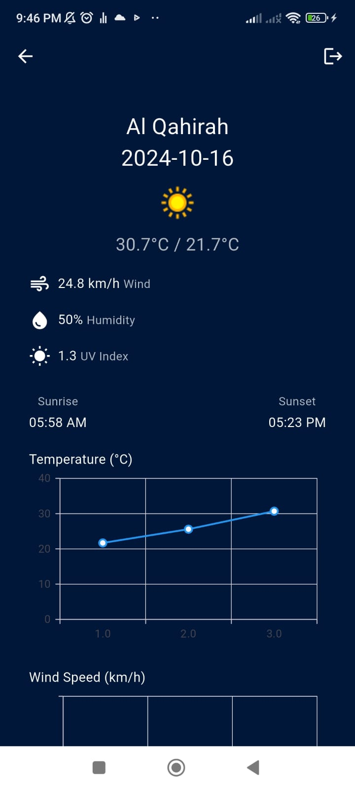
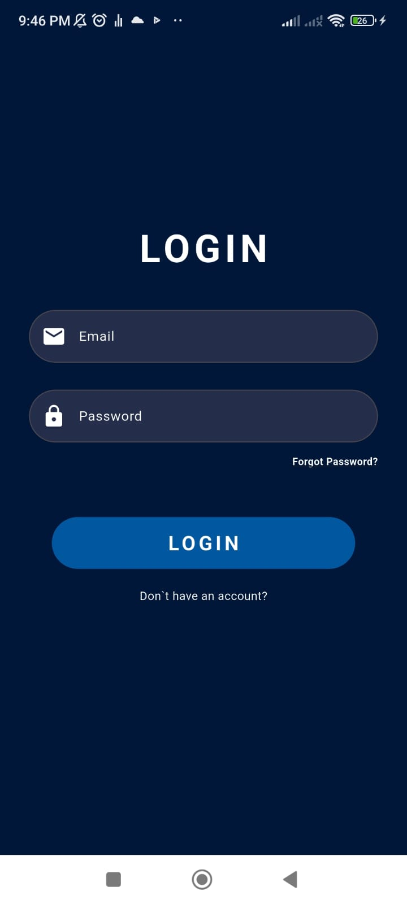
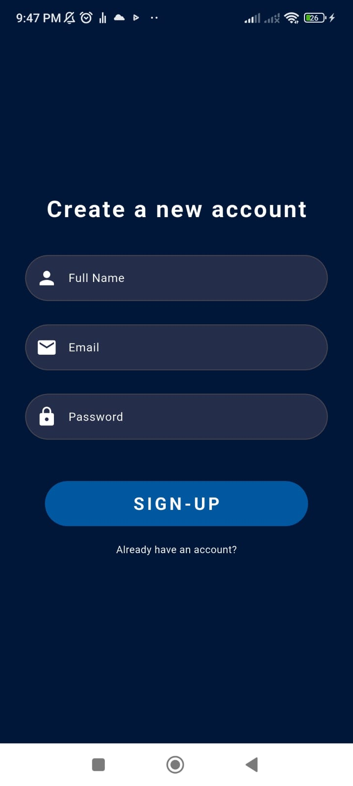

# Weather AI App

### Internship Project - Cellula Tech

---

## Overview

The **Weather AI App** is a weather forecasting application that provides real-time weather data for various locations around the world. The app is built using the principles of **Clean Architecture** and **Clean Code** and implements the **BLoC** pattern for state management. Firebase services are integrated for user authentication and data handling.

---

## Features

1. **Login Screen**  
   Users can log in using their email and password.

2. **Signup Screen**  
   New users can create an account by providing their username, email, and password.

3. **Search Country Screen**  
   Users can search for countries to get weather updates.

4. **Weather Data Screen**  
   Displays weather details such as temperature, humidity, wind speed, and more. Includes charts for visual representation of temperature trends.

---

## Architecture

This project follows **Clean Architecture** principles to maintain a separation of concerns, making the code more maintainable and testable. The project is divided into:

- **Domain Layer**: Contains business logic and use cases.
- **Data Layer**: Handles data fetching from external sources like APIs.
- **Presentation Layer**: Manages UI and state using **BLoC**.

---

## Technologies Used

- **Flutter**: UI framework for building natively compiled applications.
- **BLoC**: Business Logic Component for state management.
- **Firebase**: Authentication and cloud services.
- **Clean Architecture**: Applied to ensure maintainable and scalable code.
- **Dart**: Programming language used with Flutter.

---

## Screenshots
Here’s a look at the home screen displaying the list of products:

